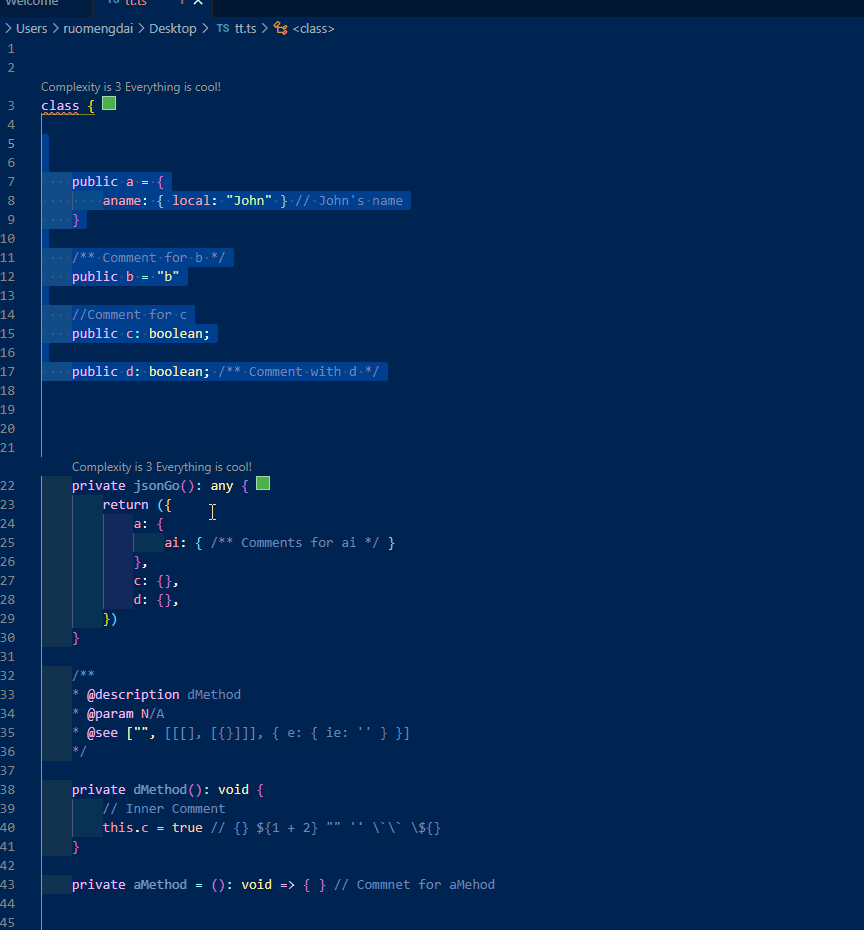

# romansort README

Sort any part sections for javascript-style code in intelligent way

## Features

Sort sections contain comments
Sort blocks  with nested blocks

## guidance

- step1: select your code section in editor
- step2: ctrl+shift+p
- step3: type ">roman.sort"

- 

## Requirements
N/A

## Extension Settings

N/A

## Known Issues

N/A

**Enjoy!**
